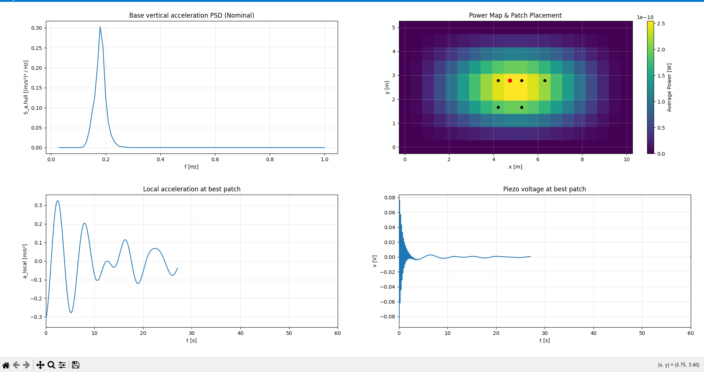

# Wave-Vibration Energy Harvester Simulation Tool

Python toolkit for simulating wave-induced ship hull vibrations
and evaluating piezoelectric energy harvesters + optimal patch placement.

## Features

- JONSWAP wave spectrum (Calm / Nominal / Rough)
- KCS-like RAOs → heave, roll, pitch motion PSDs
- Base vertical acceleration at side shell
- Panel transmissibility and local acceleration PSD
- Synthetic time-series generation from PSD
- Piezoelectric SDOF harvester model (time-domain)
- Power map over hull panel + greedy patch placement
- Animated example for KCS Nominal sea state

## How to run

```bash
python -m venv venv
venv\Scripts\activate  # Windows
pip install -r requirements.txt

python examples/example_single_patch.py
python examples/example_power_map_and_placement.py
python examples/example_kcs_nominal_panel_map.py
python examples/example_kcs_nominal_animated.py
## Simulation Overview

